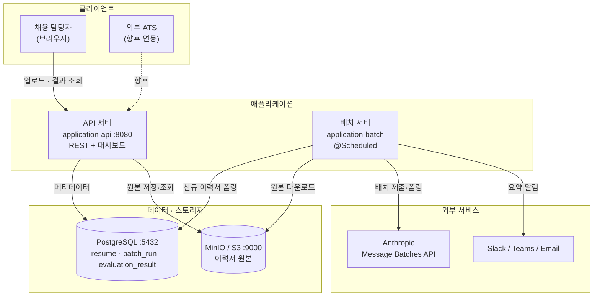
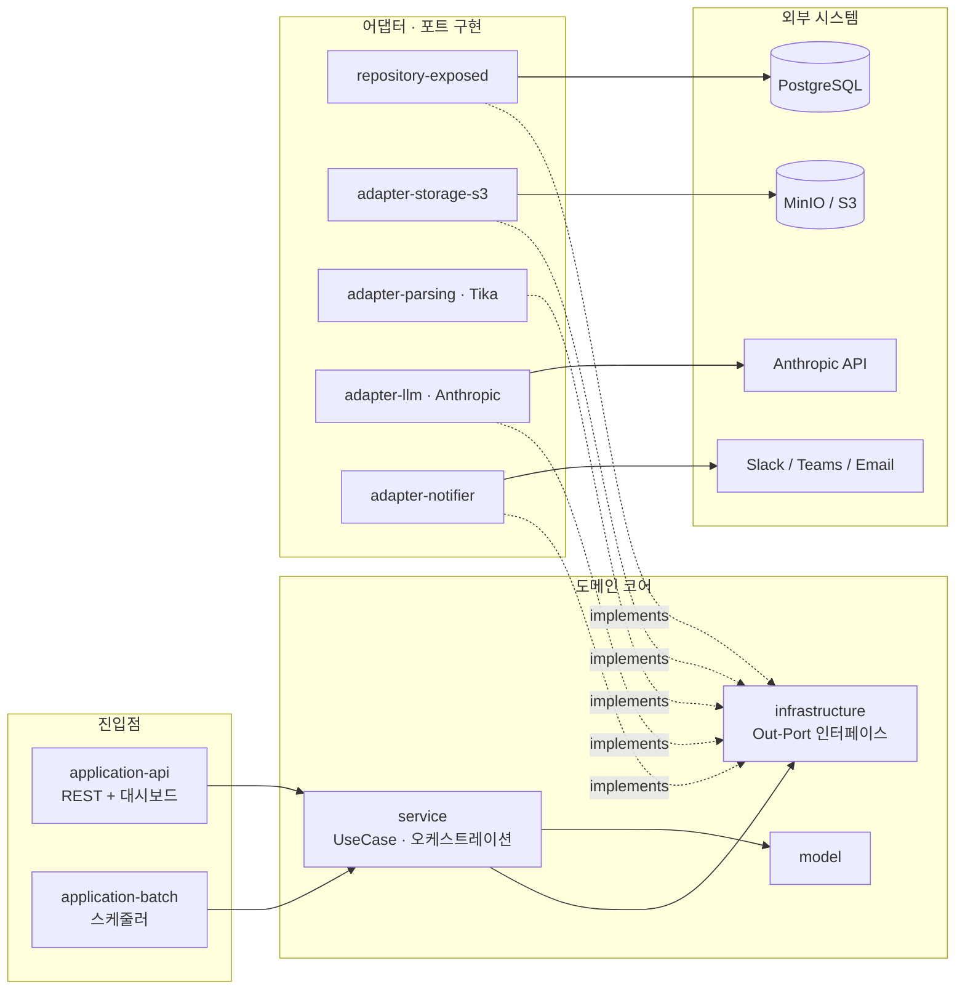
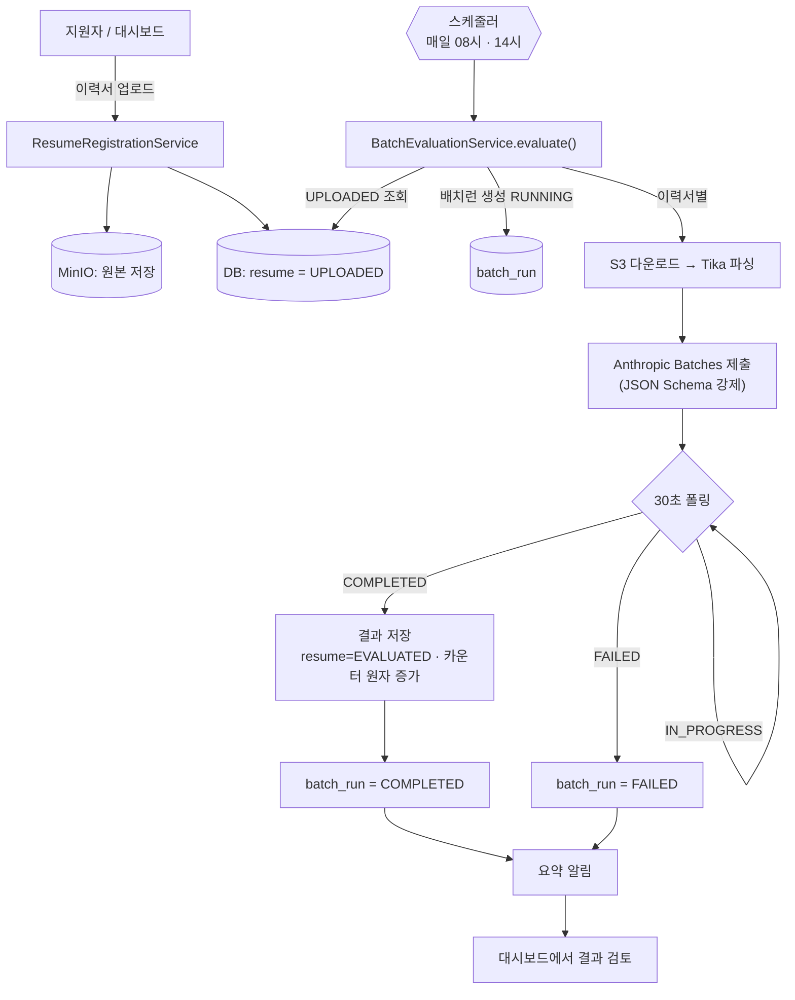

# hr-filter

AI 기반 서류 심사 필터링 시스템. 채용 공고와 지원자 이력서를 LLM으로 비교 평가해
**통과 / 보류 / 탈락** 판정과 근거·세부 점수를 산출한다.

- 설계 결정과 트레이드오프: [`docs/technical-challenges.md`](docs/technical-challenges.md)
- 개발 일지: [`docs/devlog.md`](docs/devlog.md)

**스택**: Kotlin · Spring Boot 3.4 · Exposed · PostgreSQL · Anthropic Message Batches API · AWS S3 / MinIO · Thymeleaf · Gradle 멀티모듈(14)

---

## 설계 원칙

- **명시적 조립 > 암묵적 마법.** `@ComponentScan`을 쓰지 않고 모든 빈을 `@AutoConfiguration`으로 명시 등록한다. "어떤 빈이 어디서 왜 등록되는가"가 코드에 드러난다.
- **규칙은 문서가 아니라 빌드로 강제.** 레이어 의존 방향(`api → service → infrastructure`)을 Gradle 모듈 그래프로 컴파일타임에 막는다. 위반하면 빌드가 깨진다.
- **외부 세계는 포트 뒤에.** 도메인은 인터페이스(Out-Port)에만 의존하고, Tika·S3·Anthropic·Slack 같은 구현은 어댑터로 격리·교체 가능하게 둔다.
- **트레이드오프는 도메인 특성에 근거.** 예: 서류 심사는 즉시성이 필요 없으므로(지연 허용) 동기 LLM 호출 대신 비동기 배치를 택해 비용·처리량을 얻는다.
- **골격 먼저, 그다음 실로직.** 컴파일 통과 → 컨텍스트 로드 → 실제 로직 순으로 마일스톤을 쪼갠다. 한 번에 끝까지 가려다 디버깅 지옥에 빠지지 않는다.
- **도구는 비즈니스 정당성으로 선택.** 트렌디함이 아니라 실제 니즈가 도입 트리거다. 벡터 DB·이벤트 버스 등은 트리거가 올 때까지 의도적으로 미룬다.

---

## 시스템 구성 (런타임 토폴로지)

API 서버와 배치 서버는 **독립 배포되는 두 프로세스**로, PostgreSQL과 오브젝트 스토리지를
공유한다. 무거운 LLM 작업은 배치 서버에만 격리되어 API 응답성에 영향을 주지 않는다.



---

## 아키텍처 (헥사고날 / 포트 & 어댑터)

`service`는 `infrastructure`의 **Out-Port 인터페이스에만** 의존하고, 구현체(어댑터)는
각 모듈에 격리된다. 빈은 `@ComponentScan` 없이 `@AutoConfiguration`으로 명시 조립하며,
레이어 의존 방향은 Gradle 모듈 그래프로 컴파일타임에 강제된다.



---

## 평가 파이프라인

이력서 평가는 지연 허용 업무이므로 동기 호출 대신 **비동기 배치**(Anthropic Message
Batches API, 50% 비용 절감)로 처리한다. 스케줄러가 신규 이력서를 모아 제출하고, 결과를
폴링해 저장한 뒤 요약 알림을 보낸다.



---

## 사전 준비
- Java 21
- Docker

## 로컬 실행

```bash
# 0. 시크릿/환경 변수 준비
cp .env.example .env              # 값 채우기 (ANTHROPIC_API_KEY 등)
set -a && source .env && set +a   # 현재 셸에 로드

# 1. 인프라 (Postgres + MinIO + 버킷 초기화)
docker compose up -d

# 2. API 서버 — 대시보드 + REST + Swagger
./gradlew :application-api:bootRun
#   대시보드  http://localhost:8080/dashboard
#   Swagger   http://localhost:8080/swagger-ui/index.html

# 3. 배치 서버 — 스케줄러 (local-dev 프로필: 매 1분)
./gradlew :application-batch:bootRun --args='--spring.profiles.active=local-dev'
```

> **시크릿은 `application.yml`에 두지 않는다.** yml은 `${VAR:기본값}` 플레이스홀더만 갖고
> 실제 값은 환경 변수로 주입한다(12-factor). 로컬은 `.env`(gitignore 처리), 운영은
> 시크릿 스토어(Vault / AWS Secrets Manager / K8s Secret)를 권장.

### 환경 변수

전체 목록과 기본값은 [`.env.example`](.env.example) 참고. 핵심:

| 변수 | 설명 | 비고 |
|---|---|---|
| `ANTHROPIC_API_KEY` | LLM 평가 키 | 배치 서버 필수 |
| `HRFILTER_NOTIFIER_CHANNEL` | `slack` / `teams` / `email` | 기본 `slack` |
| `HRFILTER_SLACK_WEBHOOK_URL` | 알림 웹훅 | 검증 시 webhook.site 권장 |
| `HRFILTER_LLM_MODEL` | 평가 모델 | 기본 `claude-opus-4-8` |
| `SPRING_DATASOURCE_*` | Postgres 접속 | 로컬 docker-compose 기본값 |
| `HRFILTER_S3_*` | MinIO / S3 접속 | 로컬 docker-compose 기본값 |

### 포트

| 구성 요소 | 포트 |
|---|---|
| API 서버 | 8080 (`local-dev` 프로필 12346) |
| 배치 actuator | 12347 |
| MinIO API / 콘솔 | 9000 / 9001 |
| PostgreSQL | 5432 |

### API 엔드포인트

| 메서드 | 경로 | 설명 |
|---|---|---|
| `POST` | `/api/v1/resumes` | 이력서 업로드 (multipart) |
| `GET` | `/api/v1/resumes/{id}` | 이력서 단건 조회 |
| `GET` | `/api/v1/batch-runs/{id}/evaluations` | 배치별 평가 결과 |
| `GET` | `/dashboard` | 대시보드 (HTML) |
| `POST` | `/dashboard/resumes` | 대시보드 업로드 폼 |

### 테스트

`./gradlew test` — Kotest `DescribeSpec` + MockK 단위 테스트.

---

## 모듈 구조

```
resume/
├── model              # 도메인 모델 (Identity / Model / 데이터클래스 3단)
├── exception          # 도메인 예외
├── infrastructure     # Out-Port 인터페이스 (구현 0줄)
├── schema             # Liquibase 마이그레이션
├── service            # UseCase · 배치 오케스트레이션
├── repository-exposed # Postgres 어댑터 (Exposed)
├── adapter-parsing    # Tika 이력서 파서
├── adapter-storage-s3 # S3 / MinIO 스토리지
├── adapter-llm        # Anthropic Message Batches
├── adapter-notifier   # Slack / Teams / Email
├── api                # REST 컨트롤러 + Thymeleaf 대시보드
└── batch              # @Scheduled 배치 잡
application-api         # API 서버 진입점
application-batch       # 배치 서버 진입점
```

---

## 현재 상태 / 로드맵

검증된 것 ✅ — API 기동 · 이력서 업로드 → MinIO · 대시보드 · 어댑터 와이어링 · 배치 오케스트레이션 로직 · 단위 테스트.

진행 중 / 예정:

- [x] 배치 파이프라인 실 Anthropic 키로 end-to-end 완주 검증
- [ ] 채용 공고 관리 (생성 API / 화면) — 현재는 DB 직접 입력
- [ ] 인증·인가 (이력서는 민감 PII)
- [ ] 배치 견고성 — 폴링 타임아웃, 실패 항목 재처리
- [ ] 입력 검증(Bean Validation) + 전역 예외 핸들러
- [ ] 통합 테스트, 관측성(메트릭/구조화 로깅)

자세한 설계 배경은 [`docs/technical-challenges.md`](docs/technical-challenges.md), 진행 기록은 [`docs/devlog.md`](docs/devlog.md).
